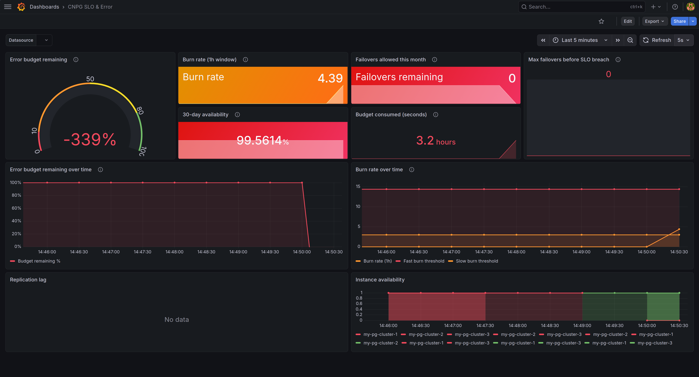
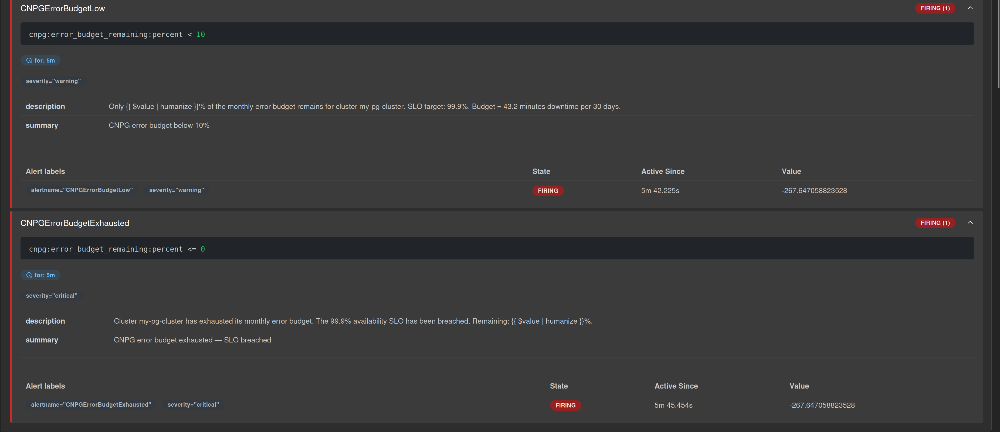

# resilient-data-poc

Chaos engineering and SRE observability lab for [CloudNativePG](https://cloudnative-pg.io/) running on Kubernetes (Minikube). Covers automated failover testing, replication verification, write-durability under primary failure, Prometheus alerting, error budget tracking, and a custom Grafana SLO dashboard.

---

## SLI / SLO / Error Budget

| SLI | SLO target | Measured | Status |
|---|---|---|---|
| Instance availability | 99.9% per 30 days | 100% at steady state | Met |
| Failover time (RTO) | < 10s | 2.2 – 4.5s | Met |
| Replication lag | < 5s | 0s at steady state | Met |
| Write lag | < 2s | 0s at steady state | Met |
| Data loss on failover | 0 rows | 0 rows | Met |

**Error budget:** 99.9% SLO = 43.2 minutes downtime allowed per 30 days = ~86 unplanned failovers at ~30s downtime per event.

---

## Screenshots

**Failover captured live — cluster mid-election:**


**Cluster fully recovered after failover:**


**SLO dashboard — error budget exhausted after chaos loop:**



**Prometheus alerts firing — budget exhausted:**



---

## Repo structure

```
.
├── postgres-cluster.yaml              # CNPG Cluster manifest
├── cnpg-chaos-test.sh                 # Failover + replication chaos test
├── cnpg-write-failover.sh             # Write-during-failover durability test
├── monitoring/
│   ├── setup-monitoring.sh            # Installs kube-prometheus-stack via Helm
│   ├── kube-prometheus-stack-values.yaml
│   ├── setup-alerts.sh                # Applies PrometheusRule and verifies alerts
│   ├── cnpg-prometheusrule.yaml       # Alert + error budget recording rules
│   ├── cnpg-slo-dashboard.json        # Custom Grafana SLO & error budget dashboard
│   └── README.md
└── docs/
    └── screenshots/
```

---

## Cluster setup

```yaml
apiVersion: postgresql.cnpg.io/v1
kind: Cluster
metadata:
  name: my-pg-cluster
spec:
  instances: 3
  imageName: ghcr.io/cloudnative-pg/postgresql:16.2
  storage:
    size: 1Gi
    storageClass: standard
  bootstrap:
    initdb:
      database: app_db
      owner: app_user
  monitoring:
    enablePodMonitor: true   # exposes metrics for Prometheus scraping
```

Install the CNPG operator first:

```bash
kubectl apply --server-side -f \
  https://raw.githubusercontent.com/cloudnative-pg/cloudnative-pg/release-1.25/releases/cnpg-1.25.1.yaml

kubectl apply -f postgres-cluster.yaml
kubectl get pods -l cnpg.io/cluster=my-pg-cluster --watch
```

---

## Test 1 — Failover + replication (`cnpg-chaos-test.sh`)

Writes a canary row to the primary, verifies replication to all replicas, hard-kills the primary, waits for election, and confirms data integrity on the new primary.

```bash
chmod +x cnpg-chaos-test.sh

./cnpg-chaos-test.sh                          # full test
./cnpg-chaos-test.sh --skip-kill              # replication check only
./cnpg-chaos-test.sh --skip-write             # failover only
CLUSTER=my-pg-cluster NAMESPACE=chatops ./cnpg-chaos-test.sh
```

### Options

| Flag | Default | Description |
|---|---|---|
| `--cluster` | `my-pg-cluster` | CNPG cluster name |
| `--namespace` | `default` | Kubernetes namespace |
| `--skip-write` | off | Skip write + replication steps |
| `--skip-kill` | off | Skip kill + failover steps |

### Results (5 runs)

```
Run          Old primary    New primary    Failover    Result
──────────────────────────────────────────────────────────────
chaos-7613   cluster-1      cluster-2      2174ms      PASS
chaos-7648   cluster-2      —              —           FAIL *
chaos-7680   cluster-2      —              —           FAIL *
chaos-7713   cluster-2      cluster-3      2437ms      PASS
chaos-7748   cluster-3      cluster-2      4532ms      PASS

* Replication lag on cluster-3 — replica still catching up after
  previous failover. Not a CNPG bug; 30s between runs was
  insufficient for full replica rejoin.

Average failover (3 passing runs): 2979ms
Fastest: 2174ms  |  Slowest: 4532ms
```

Zero data loss confirmed on all passing runs. Primary rotation covered all three pods.

---

## Test 2 — Write-during-failover (`cnpg-write-failover.sh`)

Runs a continuous insert loop at 100ms intervals while killing the primary mid-flight. Measures write outage window, sequence gaps, and pre/during/post row counts.

```bash
chmod +x cnpg-write-failover.sh

./cnpg-write-failover.sh
./cnpg-write-failover.sh --write-interval 50 --warmup-secs 5
```

### Options

| Flag | Default | Description |
|---|---|---|
| `--cluster` | `my-pg-cluster` | CNPG cluster name |
| `--namespace` | `default` | Kubernetes namespace |
| `--write-interval` | `100` | Milliseconds between writes |
| `--warmup-secs` | `3` | Seconds to write before kill |
| `--cooldown-secs` | `5` | Seconds to write after election |

### Result

```
Total write attempts:  26
  OK:    17  |  ERR: 0  |  SKIP: 9 (no primary during election)

Write outage window:   1738ms
Pre-kill rows:         6
During-outage rows:    1
Post-election rows:    10

Rows committed in DB:  17  (of 17 reported OK)
Sequence gaps:         1 *
Data loss:             0 rows

DURABILITY TEST PASSED — zero data loss on committed writes
```

**On the sequence gap:** `BIGSERIAL` sequences are non-transactional — a value consumed by an in-flight transaction that dies with the pod is permanently skipped. A gap of 1 is expected and correct. A gap > 5 would indicate real missing committed rows.

**Write outage vs failover time:** CNPG elected a new primary in 2388ms but the write outage was only 1738ms — the writer raced the election and landed one row during the transition. Application-visible downtime is shorter than infrastructure-level failover time.

---

## Observability

### Install Prometheus + Grafana

```bash
chmod +x monitoring/setup-monitoring.sh
./monitoring/setup-monitoring.sh

kubectl port-forward -n monitoring svc/prom-stack-grafana 3000:80
# http://localhost:3000 — admin / admin
```

If `kubectl get podmonitor -A` returns nothing after install, restart the CNPG operator so it re-creates the PodMonitor:

```bash
kubectl rollout restart deployment -n cnpg-system cnpg-controller-manager
```

### Apply alerting + error budget rules

```bash
kubectl apply -f monitoring/cnpg-prometheusrule.yaml
```

### Import the SLO dashboard

In Grafana: **Dashboards → New → Import** → upload `monitoring/cnpg-slo-dashboard.json` → select Prometheus datasource.

---

## Prometheus alerts

Defined in `monitoring/cnpg-prometheusrule.yaml` across three rule groups:

**`cnpg.failover` — operational alerts**

| Alert | Expression | Severity | Fires when |
|---|---|---|---|
| `CNPGInstanceDown` | `count(cnpg_collector_up == 1) < 3` | critical | fewer than 3 pods healthy for > 10s |
| `CNPGReplicationLagHigh` | `cnpg_pg_replication_lag > 5` | warning | any replica > 5s behind for > 20s |
| `CNPGWriteLagHigh` | `cnpg_pg_stat_replication_write_lag_seconds > 2` | warning | write lag > 2s for > 20s |

**`cnpg.slo` — recording rules**

Pre-computed metrics stored every 30s for efficient dashboard queries:

| Metric | What it tracks |
|---|---|
| `cnpg:availability_ratio:30d` | Availability fraction over 30 days |
| `cnpg:availability_ratio:1h` | Availability fraction over 1 hour |
| `cnpg:error_budget_remaining:percent` | % of monthly budget remaining |
| `cnpg:error_budget_burn_rate:1h` | Rate of budget consumption vs sustainable pace |

**`cnpg.error_budget` — budget alerts**

| Alert | Threshold | Severity | Meaning |
|---|---|---|---|
| `CNPGErrorBudgetFastBurn` | burn rate > 14.4x | critical | budget exhausted in ~2 hours |
| `CNPGErrorBudgetSlowBurn` | burn rate > 3x | warning | budget exhausted in ~10 days |
| `CNPGErrorBudgetLow` | budget < 10% | warning | < 4.3 minutes remaining |
| `CNPGErrorBudgetExhausted` | budget ≤ 0% | critical | 99.9% SLO breached |

---

## SLO & Error Budget dashboard

Custom Grafana dashboard (`monitoring/cnpg-slo-dashboard.json`) with 10 panels:

| Panel | Shows |
|---|---|
| Error budget gauge | % remaining — drops during failovers, recovers over time |
| Burn rate stat | Current rate — green < 3x, orange 3–14.4x, red > 14.4x |
| 30-day availability | Actual SLI vs 99.9% target |
| Failovers remaining | How many more unplanned failovers before SLO breach (~86 at start) |
| Budget consumed | Seconds spent from the 2592s monthly allowance |
| Max failovers bar gauge | Visual countdown from 86 to 0 |
| Budget over time | Timeline showing budget dropping with each chaos test |
| Burn rate over time | Timeline with slow/fast burn threshold lines |
| Replication lag | Per-pod streaming replication delay |
| Instance availability | Per-pod up/down timeline — shows exact failover moments |

---

## How failover time is measured

```bash
T_KILL=$(date +%s%3N)       # milliseconds at pod delete
# ... wait for primary label ...
T_ELECTED=$(date +%s%3N)    # milliseconds when new primary label appears
FAILOVER_MS=$(( T_ELECTED - T_KILL ))
```

Includes: Kubernetes pod deletion processing + CNPG loss detection + replica promotion + pod label update. Does not include: killed pod restarting as a replica (that takes ~30s and is what the error budget tracks as downtime).

---

## How primary detection works

Both scripts use CNPG's pod labels rather than hardcoded names:

```bash
kubectl get pod \
  -l "cnpg.io/cluster=my-pg-cluster,cnpg.io/instanceRole=primary" \
  -o jsonpath='{.items[0].metadata.name}'
```

Works correctly after any number of failovers without modification.

---

## Password handling

CNPG uses `scram-sha-256` auth even for `127.0.0.1` connections. Both scripts fetch the password from the cluster secret at runtime:

```bash
DB_PASS=$(kubectl get secret my-pg-cluster-app \
  -o jsonpath='{.data.password}' | base64 --decode)
```

Passed via `env PGPASSWORD=` on each `kubectl exec` — no `.pgpass` file, no manual export.

---

## Notes

- Replication check waits 1s before reading replicas. With < 60s between back-to-back runs a freshly rejoined replica may still be catching up — increase sleep if you see intermittent failures.
- Each `cnpg-write-failover.sh` run drops and recreates `write_failover_test` — results never bleed between runs.
- Error budget recording rules need ~2 minutes of scrape history before they return values. If `cnpg:error_budget_remaining:percent` returns empty, wait and retry.
- The `< 3` threshold in `CNPGInstanceDown` assumes exactly 3 active series. After failovers, Prometheus may briefly show stale series from old pod IPs — if the alert fires spuriously while all pods are healthy, wait 5 minutes for stale series to expire.