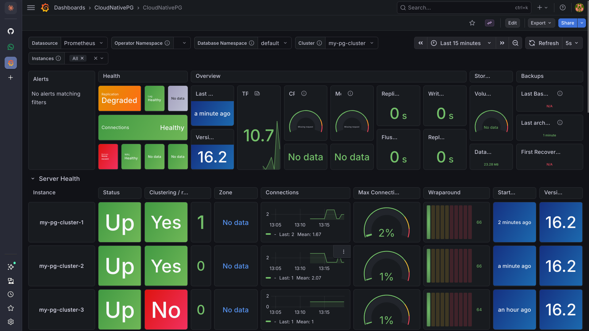
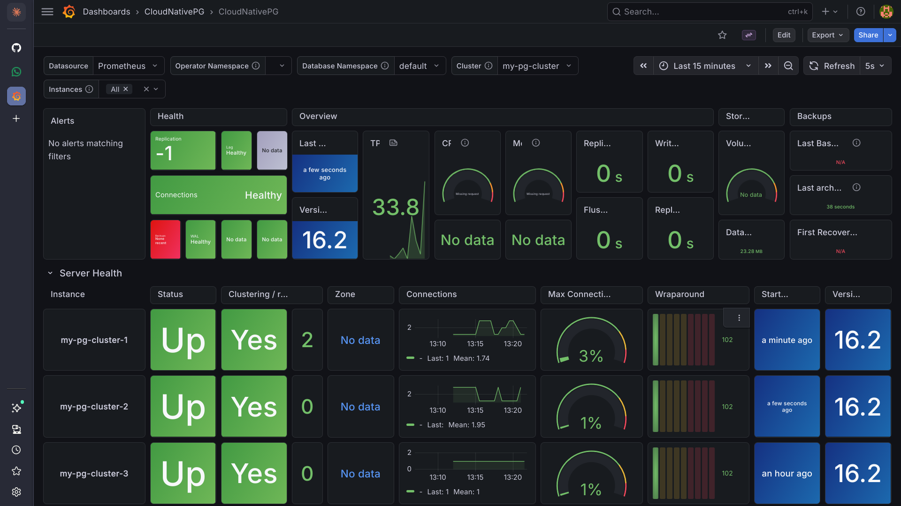

# resilient-data-poc

Chaos engineering test suite for [CloudNativePG](https://cloudnative-pg.io/) running on Kubernetes (Minikube). Validates PostgreSQL high-availability through automated failover testing, replication verification, write-durability under primary failure, and live observability with Prometheus + Grafana.

---

## Overview

| Component | Details |
|---|---|
| Platform | Kubernetes (Minikube) |
| Database | PostgreSQL 16.2 via CloudNativePG |
| Cluster topology | 1 primary + 2 replicas |
| Observability | Prometheus + Grafana (kube-prometheus-stack) |
| Measured RTO | 2.2 – 4.5 seconds |
| Data loss on failover | Zero |

---

## What's in this repo

```
.
├── postgres-cluster.yaml          # CNPG Cluster manifest
├── cnpg-chaos-test.sh             # Failover + replication chaos test
├── cnpg-write-failover.sh         # Write-during-failover durability test
├── monitoring/
│   ├── setup-monitoring.sh        # Installs kube-prometheus-stack via Helm
│   ├── kube-prometheus-stack-values.yaml
│   └── README.md                  # Monitoring setup docs
└── docs/
    └── screenshots/               # Grafana dashboard captures
```

---

## Cluster setup

```yaml
apiVersion: postgresql.cnpg.io/v1
kind: Cluster
metadata:
  name: my-pg-cluster
spec:
  instances: 3
  imageName: ghcr.io/cloudnative-pg/postgresql:16.2
  storage:
    size: 1Gi
    storageClass: standard
  bootstrap:
    initdb:
      database: app_db
      owner: app_user
  monitoring:
    enablePodMonitor: true
```

Install the CNPG operator first:

```bash
kubectl apply --server-side -f \
  https://raw.githubusercontent.com/cloudnative-pg/cloudnative-pg/release-1.25/releases/cnpg-1.25.1.yaml
```

Apply the cluster:

```bash
kubectl apply -f postgres-cluster.yaml
kubectl get pods -l cnpg.io/cluster=my-pg-cluster --watch
```

---

## Test 1 — Failover + replication (`cnpg-chaos-test.sh`)

Runs a full end-to-end chaos sequence:

1. Writes a canary row to the primary
2. Verifies the row replicated to all replicas
3. Hard-kills the primary pod (`--grace-period=0 --force`)
4. Waits for CNPG to elect a new primary and measures failover time
5. Confirms the canary row is intact on the new primary
6. Reports final cluster topology

```bash
chmod +x cnpg-chaos-test.sh

# Full test
./cnpg-chaos-test.sh

# Replication check only (no kill)
./cnpg-chaos-test.sh --skip-kill

# Failover only (no write)
./cnpg-chaos-test.sh --skip-write
```

### Options

| Flag | Default | Description |
|---|---|---|
| `--cluster` | `my-pg-cluster` | CNPG cluster name |
| `--namespace` | `default` | Kubernetes namespace |
| `--skip-write` | off | Skip write + replication steps |
| `--skip-kill` | off | Skip kill + failover steps |

### Results (5 runs)

```
Run          Old primary    New primary    Failover    Result
──────────────────────────────────────────────────────────────
chaos-7613   cluster-1      cluster-2      2174ms      PASS
chaos-7648   cluster-2      —              —           FAIL *
chaos-7680   cluster-2      —              —           FAIL *
chaos-7713   cluster-2      cluster-3      2437ms      PASS
chaos-7748   cluster-3      cluster-2      4532ms      PASS

* Replication lag on cluster-3 — replica had just rejoined after
  the previous run's failover. Not a CNPG bug; 30s between runs
  was insufficient for full replica catch-up.

Average failover (3 passing runs): 2979ms
Fastest: 2174ms  |  Slowest: 4532ms
```

All three successful runs confirmed zero data loss on the canary row. Primary rotation covered all three pods across the run set.

---

## Test 2 — Write-during-failover (`cnpg-write-failover.sh`)

Runs a continuous insert loop at 100ms intervals while killing the primary mid-flight. Measures:

- **Write outage window** — how long inserts failed or were skipped during election
- **Sequence gaps** — whether any committed transactions were lost
- **Pre/during/post breakdown** — how many rows landed in each phase

```bash
chmod +x cnpg-write-failover.sh

# Default: 100ms writes, 3s warmup, 5s cooldown
./cnpg-write-failover.sh

# Custom intervals
./cnpg-write-failover.sh --write-interval 50 --warmup-secs 5
```

### Options

| Flag | Default | Description |
|---|---|---|
| `--cluster` | `my-pg-cluster` | CNPG cluster name |
| `--namespace` | `default` | Kubernetes namespace |
| `--write-interval` | `100` | Milliseconds between writes |
| `--warmup-secs` | `3` | Seconds to write before kill |
| `--cooldown-secs` | `5` | Seconds to write after election |

### Result

```
Total write attempts:  26
  OK:    17
  ERR:   0
  SKIP:  9   (no primary visible during election)

Write outage window:   1738ms
Pre-kill rows:         6
During-outage rows:    1
Post-election rows:    10

Rows committed in DB:  17  (of 17 reported OK)
Sequence gaps:         1 *
Data loss:             0 rows

DURABILITY TEST PASSED — zero data loss on committed writes
```

**On the sequence gap:** `BIGSERIAL` sequences are non-transactional in Postgres — a value consumed by an in-flight transaction that dies with the pod is permanently skipped. A gap of 1 confirms one transaction was lost to the crash (expected and correct), but it was never committed so it is not data loss. A gap > 5 would indicate real missing committed rows.

**Write outage vs failover time:** CNPG elected a new primary in 2388ms, but the application-level write outage was only 1738ms — the writer raced the election and landed one row during the transition. This demonstrates that application-visible downtime is shorter than infrastructure-level failover time.

---

## Observability — Prometheus + Grafana

The cluster runs with `monitoring.enablePodMonitor: true`, exposing metrics that are scraped by Prometheus and visualized in Grafana via the official CNPG dashboard.

See [`monitoring/README.md`](monitoring/README.md) for full setup instructions.

### Install

```bash
chmod +x monitoring/setup-monitoring.sh
./monitoring/setup-monitoring.sh

# Access Grafana
kubectl port-forward -n monitoring svc/prom-stack-grafana 3000:80
# Open http://localhost:3000 — login: admin / admin
```

### Failover captured live in Grafana

The dashboard (time range: Last 15 minutes, refresh: 5s) shows the full failover sequence in real time while running a chaos test:



*Health transitions to "Replication Degraded", TPS spikes from the write loop, new primary appears with start time "a few seconds ago".*



*All three pods Up, Clustering: Yes, replication lag 0s — cluster fully recovered after failover.*

### Key metrics tracked

| Metric | What it shows |
|---|---|
| `cnpg_collector_up` | Whether each pod's metrics exporter is reachable |
| `cnpg_pg_replication_lag` | Streaming replication delay per replica |
| TPS | Live transaction throughput — shows write outage window during failover |
| Connections | Per-pod active connections — step change visible at moment of kill |
| Wraparound | Transaction ID exhaustion risk — should stay below 10% |

---

## How primary detection works

Both scripts use CNPG's pod labels rather than hardcoded names:

```bash
kubectl get pod \
  -l "cnpg.io/cluster=my-pg-cluster,cnpg.io/instanceRole=primary" \
  -o jsonpath='{.items[0].metadata.name}'
```

This works correctly after any number of failovers without modification.

---

## Password handling

CNPG uses `scram-sha-256` auth even for `127.0.0.1` connections inside the pod. Both scripts fetch the password from the cluster secret at runtime:

```bash
DB_PASS=$(kubectl get secret my-pg-cluster-app \
  -o jsonpath='{.data.password}' | base64 --decode)
```

Passed into the pod via `env PGPASSWORD=` on each `kubectl exec` — no `.pgpass` file, no manual export.

---

## Notes

- The replication check in `cnpg-chaos-test.sh` waits 1 second before reading from replicas to account for streaming replication lag on Minikube. With less than 60s between back-to-back runs, a replica that just rejoined may still be catching up — increase the sleep between runs if you see intermittent replica failures.
- Each `cnpg-write-failover.sh` run drops and recreates `write_failover_test` so results never bleed between runs.
- Failover time is measured from `kubectl delete pod` to the moment a pod acquires the `primary` role label — wall-clock time including Kubernetes pod scheduling and CNPG promotion logic.
- If `kubectl get podmonitor -A` returns nothing after installing the monitoring stack, restart the CNPG operator: `kubectl rollout restart deployment -n cnpg-system cnpg-controller-manager`. The PodMonitor is only created on operator startup if the Prometheus CRDs already exist.